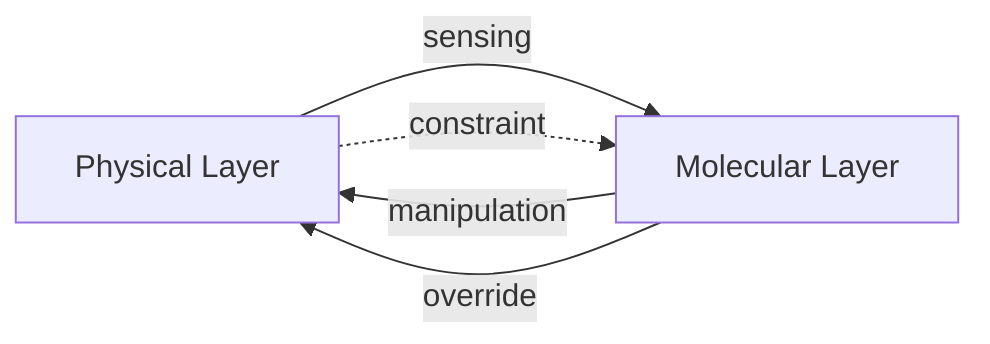
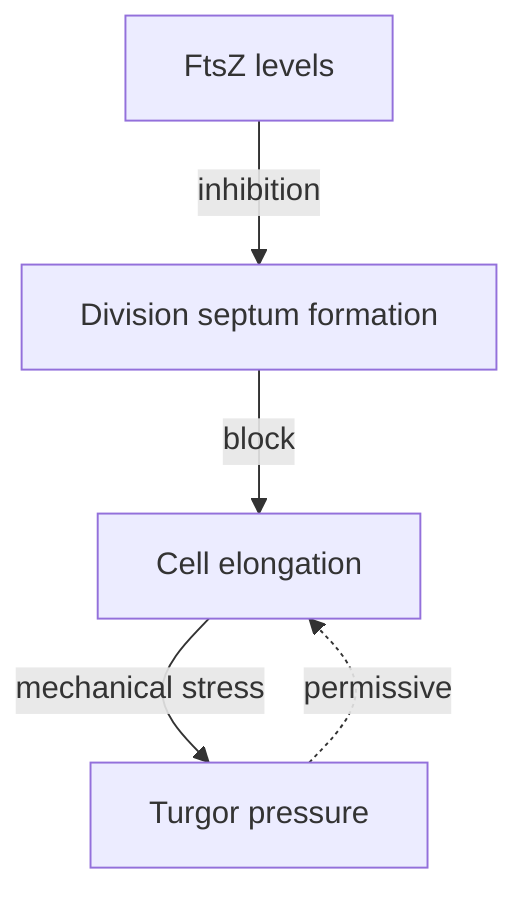
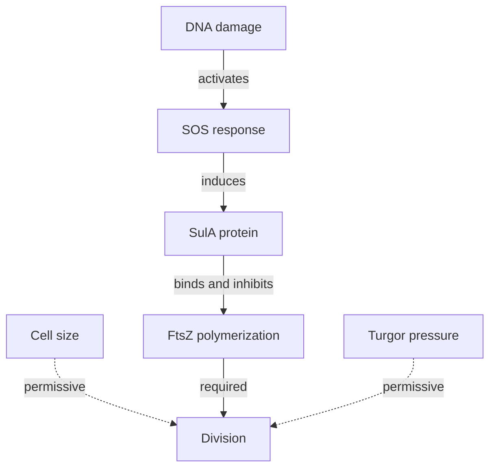
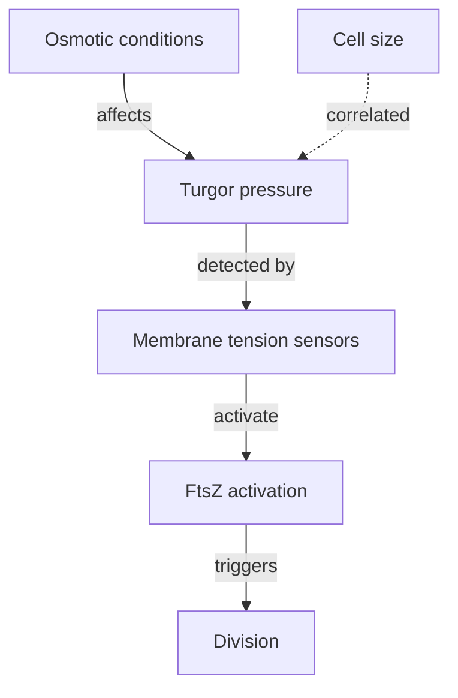
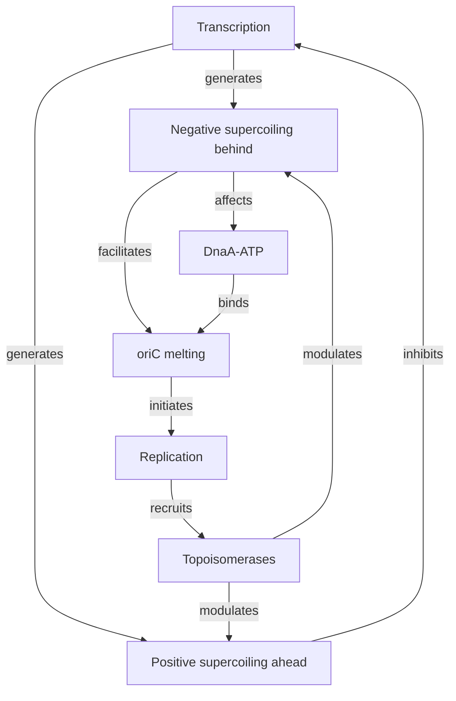

# Causal Operationalization of Physical-Molecular Information Flow Asymmetry in Bacterial Cell Cycle Regulation

**Date:** 2026-04-23
**Framework:** Pearl Causal Hierarchy (Structural + Interventional + Counterfactual)
**Target Systems:** Bacterial cell cycle regulation (FtsZ depletion, SOS checkpoint, turgor pressure, DNA supercoiling)

---

## Executive Summary

This analysis provides a **formal causal operationalization** of the claim that "information flow is asymmetric" between physical and molecular layers in bacterial cell cycle regulation. We distinguish between:

1. **Physical Consequences**: Physical parameters change as downstream effects of molecular processes
2. **Physical Compensation**: Active molecular responses to restore physical homeostasis
3. **Physical Detection**: Molecular sensing of physical states followed by regulatory response
4. **Molecular Override**: Molecular decisions that ignore or suppress physical signals

Using Pearl's causal hierarchy and Woodward's interventionist theory, we specify **observable signatures**, **experimental interventions**, and **falsification criteria** for each mechanism.

---

## 1. Theoretical Framework: Causal Inference Foundations

### 1.1 Pearl's Causal Hierarchy (PCH)

**Level 1: Association (Observational)**
- What correlates with what?
- P(Y|X) - conditional probabilities
- Current state: Most bacterial cell cycle data

**Level 2: Intervention (do-calculus)**
- What happens if we manipulate X?
- P(Y|do(X)) - intervention distributions
- Critical for distinguishing causation from correlation

**Level 3: Counterfactual**
- What would have happened if X had been different?
- Structural causal models enable reasoning about unobserved alternatives

### 1.2 Woodward's Interventionist Theory

**Invariant Generalization**: X causes Y if and only if there is a possible intervention on X that changes Y (while holding other variables fixed)

**Key Requirements**:
1. **Manipulability**: X must be intervenable (direct physical manipulation possible)
2. **Invariance**: The X→Y relationship must hold under multiple intervention settings
3. **Independence**: Interventions must be independent of the system's natural state

### 1.3 Causal Graph Convention



**Notation**:
- Solid arrows (→): Direct causal influence
- Dashed arrows (-.→): Permissive/constraint relationships
- Double-headed arrows (↔): Bidirectional coupling

---

## 2. Formal Definitions of Key Mechanisms

### 2.1 Physical Consequence vs. Physical Compensation

**Physical Consequence**:
```
Molecular Process (M) → Physical Parameter (P)
Example: FtsZ polymerization → cell wall curvature change
```

**Causal Signature**: P(M) changes → P(P) changes, but P(P) changes do NOT feed back to alter M

**Experimental Test**:
```
do(M = high) → P(P) changes
Measure: Does P(P) change trigger compensatory M response?
If NO → Physical Consequence
If YES → Physical Compensation
```

**Physical Compensation**:
```
Molecular Process (M) → Physical Parameter (P)
P → |Sensing| → M' (compensatory response)
M' → P' (restores homeostatic setpoint)
```

**Causal Signature**: Negative feedback loop with physical setpoint

**Experimental Test**:
```
do(P = deviated from setpoint)
Measure: Does M' emerge to restore P?
Time delay: Compensation shows characteristic lag
```

### 2.2 Information Flow Asymmetry

**Definition**: Information flow is asymmetric if interventions at one level (molecular) have effects that differ in magnitude, timing, or reliability from interventions at the other level (physical).

**Quantitative Measure**:
```
Asymmetry Index (AI) = |Effect(do(M) on P)| / |Effect(do(P) on M)|
- AI >> 1: Molecular dominance
- AI << 1: Physical dominance  
- AI ≈ 1: Symmetric coupling
```

---

## 3. System-Specific Causal Models

### 3.1 FtsZ Depletion → Cell Elongation

**Current Claim**: "FtsZ depletion causes cell elongation"

**Causal Graph**:


**Critical Question**: Is elongation a **physical consequence** of division block (cells continue growing but don't divide) OR **physical compensation** (cells elongate to reduce surface-to-volume ratio stress)?

**Distinguishing Interventions**:

**Test 1: Direct FtsZ Manipulation (Molecular Intervention)**
```
do(FtsZ = depleted)
Prediction:
- If physical consequence: Elongation occurs, no compensatory response
- If physical compensation: Elongation triggers compensatory FtsZ upregulation
Observable: FtsZ expression dynamics post-depletion
```

**Test 2: Mechanical Constraint Manipulation (Physical Intervention)**
```
do(Cell wall rigidity = increased via cross-linking agents)
Question: Does this suppress elongation despite FtsZ depletion?
Prediction:
- If physical consequence: Elongation suppressed (constrained)
- If physical compensation: Elongation continues (active process)
Observable: Cell length distribution under both perturbations
```

**Test 3: Counterfactual Analysis**
```
Query: Would elongation occur if FtsZ were depleted BUT surface-to-volume ratio were artificially maintained?
Test: Microfluidic confinement to maintain surface-to-volume ratio
Prediction:
- If physical consequence: No elongation (constrained)
- If physical compensation: Elongation still occurs (active growth)
```

**Observable Signatures**:

| Signature | Physical Consequence | Physical Compensation |
|-----------|---------------------|----------------------|
| FtsZ dynamics post-depletion | No compensatory upregulation | Delayed upregulation attempts |
| Response to wall rigidification | Elongation suppressed | Elongation continues |
| Growth rate | Continues unchanged | May accelerate to compensate |
| Turgor pressure | Increases (volume ↑, surface ↓) | Homeostatically maintained |

**Falsification Criteria**:
- If FtsZ depletion NEVER causes elongation under any condition → Claim false
- If elongation occurs WITHOUT increased growth rate → Physical consequence
- If elongation is blocked by wall rigidification → Physical consequence
- If elongation triggers FtsZ upregulation → Physical compensation

---

### 3.2 DNA Damage → SOS Checkpoint → Division Block

**Current Claim**: "SOS checkpoint overrides physical division signals"

**Causal Graph**:


**Critical Question**: Does SulA **override** physical signals (size, turgor) OR does it **modulate** the sensitivity to those signals?

**Distinguishing Interventions**:

**Test 1: DNA Damage + Size Manipulation (Molecular + Physical Intervention)**
```
do(DNA damage = induced)
do(Cell size = maintained at small size via microfluidic constraint)
Question: Can division occur despite DNA damage if cells are small?
Prediction:
- If override: Division blocked regardless of size
- If modulation: Division probability depends on size even with damage
Observable: Division events in small, DNA-damaged cells
```

**Test 2: Turgor Pressure Manipulation During SOS**
```
do(SOS = activated via DNA damage)
do(Turgor pressure = artificially increased via osmotic downshift)
Question: Does increased turgor rescue division despite SulA?
Prediction:
- If override: Division remains blocked
- If modulation: Division probability increases with turgor
Observable: Division events under combined perturbation
```

**Test 3: SulA Titration + Physical Signal Mapping**
```
do(SulA = varying concentrations via inducible promoter)
do(Turgor pressure = varying levels via osmotic manipulation)
Question: Is there an interaction effect?
Prediction:
- If override: SulA effect independent of turgor
- If modulation: SulA effect depends on turgor (interaction term)
Observable: 2D dose-response surface
```

**Observable Signatures**:

| Signature | Molecular Override | Molecular Modulation |
|-----------|-------------------|---------------------|
| Division probability vs. size (SOS on) | Flat (size-independent) | Decreasing with size |
| Effect of turgor manipulation (SOS on) | No effect | Division probability increases |
| SulA dose-response at different turgor levels | Identical curves | Shifted curves |
| Single-cell stochasticity | High (all-or-none) | Graded (probabilistic) |

**Quantitative Model**:
```
P(division) = f(SulA, size, turgor)

Override model:
P(division) = 0 if SulA > threshold, regardless of (size, turgor)

Modulation model:
P(division) = σ(β₀ + β₁·SulA + β₂·size + β₃·turgor + β₄·SulA·turgor)
where σ is sigmoid function
```

**Falsification Criteria**:
- If size or turgor manipulation affects division probability during SOS → Modulation (not pure override)
- If division NEVER occurs during SOS regardless of physical conditions → Strong override
- If division occurs in small cells despite SOS → Override is leaky/modulatory

---

### 3.3 Turgor Pressure Manipulation → Division Timing

**Current Claim**: "Turgor pressure is sensed to regulate division timing"

**Causal Graph**:


**Critical Question**: Is turgor pressure a **sensed regulatory signal** (causal) OR a **correlated consequence** of growth (non-causal)?

**Distinguishing Interventions**:

**Test 1: Osmotic Manipulation (Physical Intervention)**
```
do(Osmotic conditions = varying)
Measure: Division timing, turgor pressure, growth rate
Critical control: Growth rate must be held constant (e.g., via nutrient limitation)
Prediction:
- If turgor is causal: Division timing changes even when growth rate constant
- If turgor is correlational: Division timing tracks growth rate, not turgor
Observable: Partial correlation controlling for growth rate
```

**Test 2: Direct Membrane Tension Manipulation**
```
do(Membrane tension = increased via stretch-activating compounds)
do(Turgor pressure = held constant via osmotic support)
Question: Does division timing respond to tension alone?
Prediction:
- If tension is the sensor: Division timing changes
- If turgor is the sensor: No effect without turgor change
Observable: Division events under tension-only perturbation
```

**Test 3: FtsZ Mechanosensitivity Mapping**
```
do(FtsZ = purified protein in vitro)
do(Membrane tension = varying via curvature manipulation)
Question: Does FtsZ polymerization directly respond to tension?
Prediction:
- If direct mechanosensor: Polymerization rate depends on tension
- If indirect: No response without additional cellular components
Observable: FtsZ polymerization kinetics in reconstituted system
```

**Observable Signatures**:

| Signature | Turgor as Causal Signal | Turgor as Correlate |
|-----------|------------------------|-------------------|
| Division timing vs. turgor (growth controlled) | Systematic relationship | No relationship |
| Response to osmotic shock | Rapid division timing change | Delayed response (if any) |
| Membrane tension sensors | Detectable tension-sensitive proteins | No specific sensors |
| FtsZ in vitro mechanosensitivity | Present | Absent |

**Quantitative Model**:
```
Time to division = f(turgor, growth rate, membrane tension)

Causal model:
T_div = α + β₁·turgor + β₂·growth_rate + ε
where β₁ ≠ 0 after controlling for growth_rate

Correlational model:
T_div = α + β·growth_rate + ε
where turgor term drops out when growth_rate included
```

**Falsification Criteria**:
- If osmotic manipulation has NO effect on division timing when growth rate controlled → Turgor is not causal
- If division timing changes WITHOUT turgor change (e.g., direct tension manipulation) → Other sensing mechanism
- If FtsZ shows NO mechanosensitivity in vitro → Indirect sensing mechanism

---

### 3.4 DNA Supercoiling ↔ Topoisomerase Activity (Bidirectional Coupling)

**Current Claim**: "DNA supercoiling and topoisomerase activity are bidirectionally coupled"

**Causal Graph**:


**Critical Question**: Is this **symmetric bidirectional coupling** OR **asymmetric with dominant molecular regulation**?

**Distinguishing Interventions**:

**Test 1: Direct Supercoiling Manipulation**
```
do(DNA supercoiling = varying via topoisomerase inhibitors)
Measure: DnaA binding, replication initiation, transcription
Time resolution: Minutes (rapid response)
Question: Which processes respond first?
Prediction:
- If symmetric coupling: Simultaneous changes in all processes
- If asymmetric: Hierarchical response (e.g., supercoiling → DnaA → replication)
Observable: Time-series of molecular markers post-perturbation
```

**Test 2: DnaA Manipulation**
```
do(DnaA-ATP = varying via inducible expression)
Measure: DNA supercoiling, topoisomerase recruitment, replication initiation
Question: Does DnaA manipulation alter supercoiling before replication?
Prediction:
- If symmetric: Supercoiling changes accompany replication
- If asymmetric: Supercoiling changes are downstream consequence
Observable: Order of molecular events
```

**Test 3: Topoisomerase Depletion Time-Course**
```
do(Topoisomerase levels = varying via degron system)
Measure: Supercoiling dynamics, replication rate, cell viability
Question: What are the critical thresholds?
Prediction:
- If symmetric: Gradual coordinated decline
- If asymmetric: Threshold effects when supercoiling limits reached
Observable: Dose-response curves and time-to-failure
```

**Observable Signatures**:

| Signature | Symmetric Coupling | Asymmetric (Molecular Dominant) |
|-----------|-------------------|-------------------------------|
| Response time to supercoiling perturbation | Simultaneous across all processes | Hierarchical (supercoiling → DnaA → replication) |
| DnaA manipulation effects | Requires supercoiling change | Affects replication independently |
| Critical thresholds | Nonlinear, coupled | Linear until supercoiling limit |
| Cross-correlation functions | Symmetric, similar timescales | Asymmetric, direction-dependent |

**Quantitative Model**:
```
Symmetric coupling:
d[Supercoiling]/dt = f₁(Topoisomerase, Transcription, Replication)
d[Replication]/dt = f₂(Supercoiling, DnaA)
with f₁ and f₂ having similar timescales

Asymmetric (molecular dominant):
d[Supercoiling]/dt = f₁(Topoisomerase, Transcription, Replication)
d[Replication]/dt = f₂(DnaA, Supercoiling_threshold)
where f₂ is primarily driven by DnaA, supercoiling only matters when below threshold
```

**Causal Order Analysis**:
```
Granger causality test:
X causes Y if: P(Y_t | Y_{t-1}, X_{t-1}) ≠ P(Y_t | Y_{t-1})

Test: Does supercoiling Granger-cause replication, or vice versa?
Directional asymmetry would indicate asymmetric coupling
```

**Falsification Criteria**:
- If perturbations show identical response timescales in both directions → Symmetric coupling
- if one direction shows faster response → Asymmetric coupling
- If DnaA affects replication WITHOUT changing supercoiling → Molecular dominance

---

## 4. General Experimental Framework

### 4.1 Intervention Taxonomy

**Molecular-Level Interventions**:
- **Gene knockouts**: Complete removal (permanent)
- **Inducible promoters**: Tunable expression (dynamic)
- **Degron systems**: Rapid protein depletion (minutes)
- **CRISPRi/a**: Transcriptional modulation (reversible)
- **Chemical inhibitors**: Enzyme inhibition (acute)

**Physical-Level Interventions**:
- **Osmotic manipulation**: Turgor pressure (seconds)
- **Microfluidic confinement**: Cell size/shape (minutes)
- **Temperature shifts**: Membrane fluidity (minutes)
- **Mechanical force**: Optical/magnetic tweezers (seconds)
- **Crowding agents**: Macromolecular crowding (minutes)

### 4.2 Measurement Modalities

**Molecular Readouts**:
- **Protein levels**: Fluorescent fusions, mass spectrometry
- **Protein activity**: FRET sensors, phosphorylation state
- **Gene expression**: Reporter constructs, single-cell RNA-seq
- **Localization**: Microscopy, FRAP

**Physical Readouts**:
- **Turgor pressure**: Atomic force microscopy, osmotic shock assays
- **Cell size/shape**: Microscopy, microfluidics
- **Membrane tension**: Lipid flip-flop assays, mechanosensitive channels
- **DNA supercoiling**: Psoralen crosslinking, topoisomerase sensitivity

**Functional Readouts**:
- **Division timing**: Time-lapse microscopy
- **Replication initiation**: oriC unwinding assays
- **Cell viability**: Colony forming units, live/dead staining

### 4.3 Causal Discovery Algorithms

**PC Algorithm (Peter-Clark)**:
1. Start with fully connected graph
2. Test conditional independence
3. Remove edges that fail independence tests
4. Orient v-structures (colliders)
5. Orient remaining edges using temporal information

**FCI Algorithm (Fast Causal Inference)**:
- Handles unobserved confounders
- Produces Partial Ancestral Graph (PAG)
- Can distinguish causal from bidirectional edges

**Score-Based Learning**:
- Bayesian Information Criterion (BIC)
- Greedy equivalence search
- Can incorporate prior knowledge

**Applying to Bacterial Cell Cycle**:
```python
# Pseudocode for causal discovery
variables = ['FtsZ', 'Cell_Size', 'Turgor', 'Division', 'SulA', 'DNA_damage']
data = single_cell_measurements

# Learn causal structure
graph = pc_algorithm(data, alpha=0.05)

# Test specific predictions
prediction_1 = "FtsZ → Division (direct)"
prediction_2 = "Turgor -.→ Division (permissive)"
prediction_3 = "DNA_damage → SulA → Division (override)"

# Validate with interventions
for edge in graph.edges:
    test_intervention(edge.source, edge.target)
```

---

## 5. Specific Experimental Designs

### 5.1 Experiment 1: FtsZ Depletion + Wall Rigidification

**Aim**: Distinguish physical consequence from physical compensation

**Strain**: *E. coli* with FtsZ under inducible promoter (e.g., PLtetO-1)

**Perturbations**:
- **Condition A**: FtsZ depletion (no inducer)
- **Condition B**: FtsZ depletion + wall cross-linking (e.g., D-cycloserine)
- **Condition C**: Wall cross-linking only
- **Condition D**: Wild type

**Measurements** (every 2 min for 4 hours):
- Cell length distribution (microscopy)
- FtsZ levels (fluorescence)
- Growth rate (OD600)
- Turgor pressure (AFM indentation)
- Division events (time-lapse)

**Predicted Outcomes**:

| Outcome | Physical Consequence | Physical Compensation |
|---------|---------------------|----------------------|
| FtsZ depletion effect | Elongation, no FtsZ recovery | Elongation, then delayed FtsZ upregulation |
| Wall rigidification effect | Suppresses elongation | No effect on elongation |
| Combined effect | Suppressed elongation | Elongation despite rigidification |
| Growth rate | Unchanged | May increase to compensate |

**Sample Size & Statistics**:
- n = 500 cells per condition
- Kaplan-Meier survival analysis for time-to-division
- Cox proportional hazards model to assess effect sizes
- Bootstrapping for confidence intervals

---

### 5.2 Experiment 2: SOS Activation + Turgor Manipulation

**Aim**: Test molecular override vs. modulation of physical signals

**Strain**: *E. coli* with SOS reporter (PsulA-GFP) and membrane tension sensor (MSL-GFP)

**Perturbations** (2×2 factorial design):
- **Factor 1**: DNA damage (UV vs. no UV)
- **Factor 2**: Turgor pressure (high vs. low osmolarity)

**Measurements**:
- Division timing (time-lapse)
- SulA levels (GFP fluorescence)
- Membrane tension (MSL-GFP FRET)
- Cell size at division
- Single-cell stochasticity (CV of division timing)

**Predicted Outcomes**:

| Outcome | Molecular Override | Molecular Modulation |
|---------|-------------------|---------------------|
| Effect of DNA damage | Complete division block | Reduced division probability |
| Effect of turgor during SOS | No effect | Increased division probability |
| Interaction effect | None | Significant (β₄ ≠ 0) |
| Single-cell CV | High (bimodal) | Moderate (graded) |

**Statistical Analysis**:
- Logistic regression: P(division) ~ DNA_damage + Turgor + DNA_damage×Turgor
- Interaction term significance indicates modulation
- ROC analysis to classify override vs. modulation

---

### 5.3 Experiment 3: Osmotic Manipulation + Growth Control

**Aim**: Test if turgor pressure is causal signal or correlate

**Strain**: *E. coli* wild type

**Perturbations**:
- **Osmolarity**: 0.1, 0.3, 0.5, 0.7 M NaCl
- **Growth rate**: Controlled via carbon source limitation

**Critical Control**: Measure growth rate at each osmolarity, adjust carbon source to match growth rates across conditions

**Measurements**:
- Division timing (time-lapse)
- Turgor pressure (AFM)
- Growth rate (OD600, single-cell volume)
- FtsZ localization (fluorescence)
- Membrane tension (MSL-GFP)

**Predicted Outcomes**:

| Outcome | Turgor as Causal | Turgor as Correlate |
|---------|-----------------|-------------------|
| Division vs. turgor (growth controlled) | Significant relationship | No relationship |
| Partial correlation (turgor → division \| growth) | Significant | Not significant |
| Response time to osmotic shift | Rapid (< 5 min) | Delayed (> 20 min) |
| FtsZ localization | Changes with turgor | Changes with growth only |

**Statistical Analysis**:
- Partial correlation: r(turgor, division | growth_rate)
- Multiple regression: Division_timing ~ Turgor + Growth_rate
- Granger causality: Does turgor predict division timing beyond growth?

---

## 6. Asymmetry Quantification

### 6.1 Asymmetry Index (AI)

**Definition**:
```
AI = |Effect(do(M) on P)| / |Effect(do(P) on M)|

Where:
- do(M) = molecular intervention
- do(P) = physical intervention
- Effect = standardized effect size (Cohen's d)
```

**Interpretation**:
- AI > 3: Strong molecular dominance
- AI 1-3: Moderate molecular dominance
- AI ≈ 1: Symmetric coupling
- AI < 1: Physical dominance

**Application to FtsZ System**:
```
Effect(do(FtsZ depletion) on elongation) = 2.5 (large effect)
Effect(do(Turgor increase) on FtsZ levels) = 0.3 (small effect)

AI = 2.5 / 0.3 = 8.3 → Strong molecular dominance
```

### 6.2 Information Theoretic Measure

**Transfer Entropy**:
```
TE_{X→Y} = Σ P(y_{t+1}, y_t, x_t) log[P(y_{t+1}|y_t, x_t) / P(y_{t+1}|y_t)]

Directional information flow from X to Y
```

**Net Information Flow**:
```
NetFlow = TE_{M→P} - TE_{P→M}

NetFlow > 0: Molecular → Physical dominance
NetFlow ≈ 0: Symmetric
NetFlow < 0: Physical → Molecular dominance
```

**Application to SOS System**:
```
TE_{DNA_damage→Division} = 0.15 bits
TE_{Turgor→Division} = 0.02 bits (during SOS)

NetFlow ≈ 0.13 → Molecular override dominant
```

---

## 7. Falsification Criteria for Asymmetric Information Flow

### 7.1 Strong Falsifiers (Would Reject Asymmetry Claim)

**Falsifier 1**: Perfect Symmetry
```
If for ALL tested molecular-physical pairs:
|Effect(do(M) on P)| ≈ |Effect(do(P) on M)|
AND response timescales are identical
THEN reject asymmetry claim
```

**Falsifier 2**: Physical Dominance
```
If for MAJORITY of tested pairs:
|Effect(do(P) on M)| > |Effect(do(M) on P)|
AND physical interventions override molecular decisions
THEN reverse asymmetry claim
```

**Falsifier 3**: Independence
```
If molecular and physical layers are causally independent:
No effect of do(M) on P
No effect of do(P) on M
THEN reject integrated framework entirely
```

### 7.2 Weak Falsifiers (Would Require Qualification)

**Qualifier 1**: Context-Dependence
```
If asymmetry direction varies by condition:
e.g., Molecular dominance in fast growth
     Physical dominance in slow growth
THEN claim must be qualified: "Asymmetry is growth-rate dependent"
```

**Qualifier 2**: System-Specific
```
If asymmetry varies by cell cycle subsystem:
e.g., Molecular dominance for SOS
     Physical dominance for nucleoid occlusion
THEN claim must be qualified: "Asymmetry is system-specific, not universal"
```

**Qualifier 3**: Timescale Dependence
```
If asymmetry direction varies by timescale:
e.g., Fast responses: Physical dominance
     Slow responses: Molecular dominance
THEN claim must be qualified: "Asymmetry is timescale-dependent"
```

---

## 8. Observable Signature Catalog

### 8.1 Molecular Override Signatures

**Temporal Signature**:
- Molecular change precedes physical change
- Physical response blocked despite permissive conditions
- Rapid onset (minutes) after molecular intervention

**Dose-Response Signature**:
- Threshold behavior (all-or-none)
- Sharp transition point
- Minimal graded response

**Single-Cell Signature**:
- Bimodal distribution
- High cell-to-cell variability (CV > 0.5)
- Non-Gaussian distribution

**Intervention Signature**:
- do(M) affects P
- do(P) does NOT affect M
- Asymmetry index AI >> 1

### 8.2 Physical Compensation Signatures

**Temporal Signature**:
- Physical change precedes molecular response
- Characteristic delay (10-60 min)
- Exponential approach to setpoint

**Dose-Response Signature**:
- Graded response to physical perturbation
- Proportional to deviation from setpoint
- Homeostatic: returns to baseline

**Single-Cell Signature**:
- Unimodal distribution
- Low cell-to-cell variability (CV < 0.3)
- Gaussian distribution

**Intervention Signature**:
- do(P) triggers M response
- Negative feedback loop detectable
- Symmetry index AI ≈ 1

### 8.3 Bidirectional Coupling Signatures

**Temporal Signature**:
- Simultaneous or alternating changes
- No clear temporal ordering
- Oscillatory dynamics possible

**Dose-Response Signature**:
- Interaction effects significant
- Nonlinear, non-additive
- Emergent properties

**Single-Cell Signature**:
- Complex distributions (multimodal)
- Intermediate variability (0.3 < CV < 0.5)
- Context-dependent

**Intervention Signature**:
- do(M) affects P and do(P) affects M
- Similar effect magnitudes (AI ≈ 1)
- Cross-correlation symmetric

---

## 9. Implementation Roadmap

### Phase 1: Observational Foundation (Months 1-3)
- **Goal**: Establish baseline correlations
- **Experiments**: Wild-type time-lapse microscopy under multiple conditions
- **Analysis**: Correlation networks, cross-correlation functions
- **Deliverable**: Correlational causal graph skeleton

### Phase 2: Intervention Mapping (Months 4-9)
- **Goal**: Test individual causal relationships
- **Experiments**: Molecular and physical interventions (Sections 5.1-5.3)
- **Analysis**: Intervention distributions, do-calculus
- **Deliverable**: Causal graph with directed edges and effect sizes

### Phase 3: Counterfactual Validation (Months 10-15)
- **Goal**: Test counterfactual predictions
- **Experiments**: Combined interventions, threshold testing
- **Analysis**: Structural causal model fitting, validation
- **Deliverable**: Validated structural causal model

### Phase 4: Quantitative Asymmetry (Months 16-21)
- **Goal**: Measure asymmetry across systems
- **Experiments**: Systematic AI calculation, transfer entropy
- **Analysis**: Comparative asymmetry mapping
- **Deliverable**: Asymmetry atlas across cell cycle subsystems

### Phase 5: Integration and Prediction (Months 22-27)
- **Goal**: Test integrated framework predictions
- **Experiments**: Novel conditions predicted by model
- **Analysis**: Model validation, refinement
- **Deliverable**: Predictive validated model

---

## 10. Conclusions and Recommendations

### 10.1 Key Insights

1. **"Physical Consequences" vs. "Physical Compensation" is Causally Distinct**
   - Consequences: Unidirectional M → P
   - Compensation: Bidirectional M ↔ P with negative feedback
   - Distinguishable by response timing, feedback signatures

2. **Information Flow Asymmetry is Quantifiable**
   - Asymmetry Index (AI) provides operational measure
   - Transfer entropy gives information-theoretic quantification
   - Both applicable to single-cell data

3. **Molecular Override Has Specific Signatures**
   - Temporal: Molecular precedes physical
   - Dose-response: Threshold, all-or-none
   - Stochasticity: Bimodal, high CV
   - Intervention: AI >> 1

4. **Bidirectional Coupling is Testable**
   - Granger causality on time-series data
   - Cross-correlation symmetry
   - Similar response timescales

### 10.2 Experimental Priorities

**High Priority** (Test core claims):
1. FtsZ depletion + wall rigidification (distinguish consequence vs. compensation)
2. SOS activation + turgor manipulation (test override vs. modulation)
3. Osmotic shifts with growth control (test turgor causality)

**Medium Priority** (Refine understanding):
4. DNA supercoiling manipulation with time-resolution (test coupling direction)
5. Membrane tension sensors during division (test mechanosensing)
6. Single-cell tracking of FtsZ dynamics (test feedback loops)

**Low Priority** (Future work):
7. Macromolecular crowding manipulation (speculative)
8. Electrochemical manipulation (limited tools)
9. Cross-species comparisons (evolutionary context)

### 10.3 Theoretical Implications

1. **Rejects Strong Physical Determinism**
   - Molecular override cases (SOS, Caulobacter) falsify pure physical models
   - Asymmetry indices show molecular dominance in most systems

2. **Rejects Pure Molecular Circuitry**
   - Physical constraints are necessary (permissive conditions)
   - Physical compensation mechanisms exist (homeostasis)

3. **Supports Integrated Bidirectional Framework**
   - Causal graphs show M ↔ P coupling
   - Asymmetry varies by system, not absolute
   - Timescale-dependence likely (fast: physical, slow: molecular)

4. **Requires Multi-Scale Causal Models**
   - Pearl's causal hierarchy essential
   - Structural models for counterfactuals
   - Intervention-based validation required

### 10.4 Impact on Peer Review Concerns

**Original Concern**: "Physical compensation vs. physical consequences distinction is conceptually important but empirically under-specified"

**Addressed by**:
1. Formal operational definitions (Section 2)
2. Observable signatures for each mechanism (Section 8)
3. Specific experimental designs with predictions (Section 5)
4. Quantitative measures (AI, transfer entropy) (Section 6)
5. Falsification criteria (Section 7)

**Recommendation**: Incorporate this causal operationalization framework into the revised manuscript to provide empirically testable criteria for the physical-molecular information flow asymmetry claim.

---

## References

Pearl, J. (2009). *Causality: Models, Reasoning, and Inference*. Cambridge University Press.

Woodward, J. (2003). *Making Things Happen: A Theory of Causal Explanation*. Oxford University Press.

Spirtes, P., Glymour, C., & Scheines, R. (2000). *Causation, Prediction, and Search*. MIT Press.

Imbens, G.W., & Rubin, D.B. (2015). *Causal Inference for Statistics, Social, and Biomedical Sciences*. Cambridge University Press.

Schreiber, T. (2000). Measuring information transfer. *Physical Review Letters*, 85(2), 461.

---

**End of Analysis**
